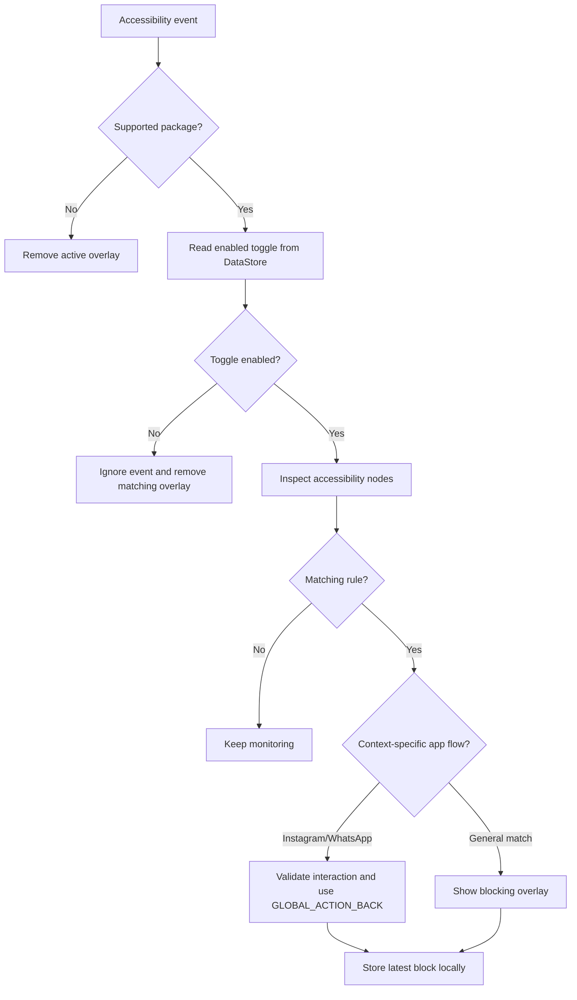

# Architecture Documentation

This document describes the current local Android implementation of Free Artificial Dumbness.

## Technology stack

- Kotlin.
- Android application module built with Gradle Kotlin DSL.
- Jetpack Compose and Material 3 for the main interface.
- Android Accessibility Service API for observing supported applications.
- Jetpack DataStore Preferences for local state.
- Java/Kotlin target 17.
- Compile and target SDK 34; minimum SDK 29.

## Module layout

```text
app/src/main/
├── AndroidManifest.xml
├── java/com/focusapp/blocker/
│   ├── MainActivity.kt
│   ├── data/FocusPreferencesRepository.kt
│   ├── model/FocusModels.kt
│   ├── service/BlockerAccessibilityService.kt
│   └── ui/theme/
└── res/
    ├── layout/
    ├── drawable/
    ├── values/
    └── xml/accessibility_service_config.xml
```

### `MainActivity`

`MainActivity` is the entry point and hosts the Compose UI. It collects the `FocusUiState` flow, renders the dashboard and independent app toggles, writes toggle changes through the repository and opens Android Accessibility settings when the user needs to enable the service.

### Models

`FocusModels.kt` defines three data structures:

- `BlockTarget`: keywords and the user-facing label for one detection rule.
- `AppToggle`: an app package, display metadata, enabled state and its detection rules.
- `FocusUiState`: service status, app toggles and the latest local block information.

### Local state

`FocusPreferencesRepository` owns the DataStore named `focus_app_preferences`. It stores:

- One Boolean value per app toggle.
- `last_blocked_summary`.
- `last_blocked_at` as a timestamp.

The repository also checks `Settings.Secure.ENABLED_ACCESSIBILITY_SERVICES` to report whether `BlockerAccessibilityService` is enabled. Toggles default to enabled when no value has been stored yet.

### Accessibility service

`BlockerAccessibilityService` is declared with `BIND_ACCESSIBILITY_SERVICE` and is limited to these packages:

| App | Android package | Main targets |
| --- | --- | --- |
| WhatsApp | `com.whatsapp` | Meta AI search, shortcut and conversation surfaces |
| Instagram | `com.instagram.android` | Meta AI, DMs and Support AI |
| Facebook | `com.facebook.katana` | Meta AI search/composer/assistant surfaces |
| X/Twitter | `com.twitter.android` | Grok and related assistant surfaces |

The service listens for window-content changes, clicks, focus changes and window-state changes. It retrieves the active accessibility tree and compares text, content descriptions, state descriptions and view IDs against the rules for the active package.

## Detection flow



## App-specific behaviour

### WhatsApp

WhatsApp handling distinguishes Meta AI search/entry points, shortcuts and conversation surfaces. It validates the surrounding accessibility tree and avoids treating search cleanup or back-navigation controls as blocked AI actions. Valid matches are recorded and handled with a global back action.

### Instagram

Instagram handling includes separate checks for Meta AI pages, direct-message entry points, composer interactions and Support AI. It uses cooldowns and signatures to avoid repeating the same block while the accessibility tree is emitting several related events.

### Facebook and X/Twitter

These packages use the general click-then-content-change flow. A matching clicked node is held briefly as a pending rule; a related subsequent window event confirms the block before the overlay is shown. Facebook rules target Meta AI labels and X/Twitter rules target Grok labels.

## Blocking overlay

The overlay is inflated from `res/layout/blocking_overlay.xml` and styled by the related drawable resources. It displays the app label, the matched rule and the affected keywords. The service removes the overlay when the package changes or when the matching surface is no longer present.

## Android permissions and service configuration

The manifest declares:

- `android.permission.BIND_ACCESSIBILITY_SERVICE` on the service declaration.
- `android.permission.FOREGROUND_SERVICE`.
- `android.permission.POST_NOTIFICATIONS`.

The current implementation does not create a separate foreground service, analytics channel or network client. Any future use of the two declared permissions must be documented here and in the privacy policy before release.

The accessibility configuration enables retrieval of window content and view IDs, disables gesture performance, and limits events to the supported packages. The user must explicitly enable the service in Android settings.

## Known technical limitations

- Accessibility heuristics depend on third-party UI text and structure.
- UI changes in WhatsApp, Instagram, Facebook or X/Twitter can invalidate matching rules.
- Accessibility Service crashes have currently been observed on HyperOS devices.
- The complete local implementation and the current remote source tree are not yet synchronised.
